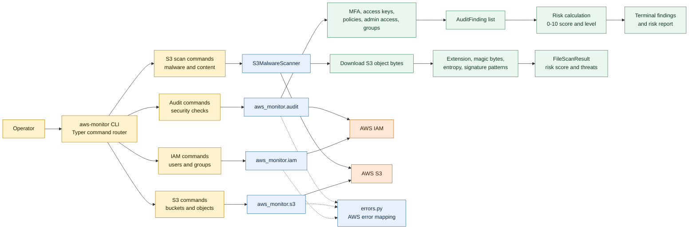
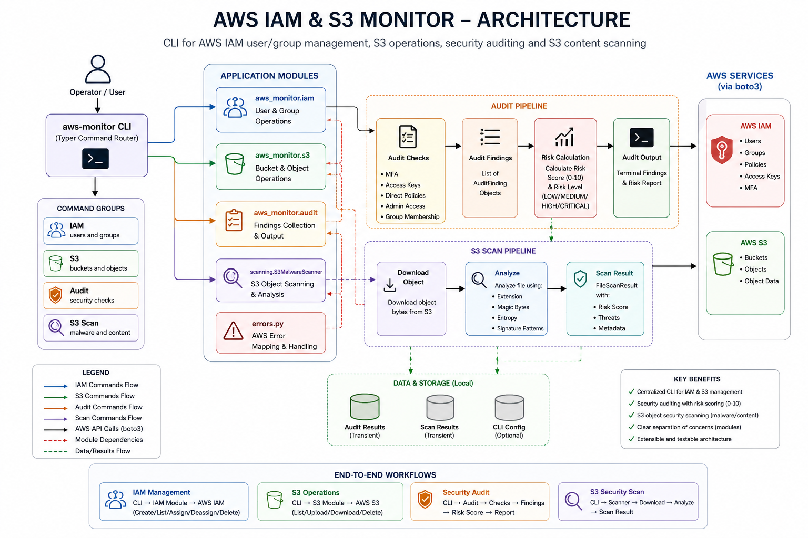

# AWS IAM & S3 Monitor

<div align="center">


CLI for AWS IAM user/group management, S3 operations, and security auditing

</div>

---

## Features

| Category | Features |
|----------|----------|
| **IAM Management** | Create, list, assign/deassign, delete IAM users and groups |
| **S3 Operations** | List buckets, upload/download objects, delete objects |
| **S3 Scanning** | Malware detection, dangerous extension scanning, entropy analysis |
| **Security Audits** | MFA compliance, access key age, admin access, policy attachements |
| **Risk Scoring** | Automated 0-10 risk calculation with severity-based findings |

---

## Architecture



### Visual Architecture



The CLI is the entry point for every workflow. Management commands call AWS directly, audit commands collect IAM findings and optionally calculate a risk score, and S3 scan commands download object bytes before analyzing them locally.

---

## Installation

```bash
# Clone the repository
git clone https://github.com/your-org/aws-iam-s3-monitor.git
cd aws-iam-s3-monitor

# Create and activate virtual environment
python -m venv .venv
source .venv/bin/activate  # Windows: .venv\Scripts\activate

# Install dependencies
pip install -e .
```

---

## Configuration

```bash
# Configure AWS credentials
aws configure

# Set region (optional)
export AWS_DEFAULT_REGION=us-east-1
```

---

## Usage

### IAM User Management

```bash
# List all IAM users
aws-monitor iam users list

# Create a new IAM user
aws-monitor iam users create <username>

# Add user to a group
aws-monitor iam users assign <username> <groupname>

# Remove user from a group
aws-monitor iam users deassign <username> <groupname>

# Delete a user (with confirmation)
aws-monitor iam users delete <username>
```

### IAM Group Management

```bash
# List all IAM groups
aws-monitor iam groups list

# List users in a group
aws-monitor iam groups users <groupname>
```

### S3 Operations

```bash
# List all S3 buckets
aws-monitor s3 list

# List objects in a bucket
aws-monitor s3 objects <bucket-name>

# Upload a file
aws-monitor s3 upload <bucket-name> <file-path> <object-key>

# Download an object
aws-monitor s3 download <bucket-name> <object-key> <local-path>

# Delete an object
aws-monitor s3 delete <bucket-name> <object-key>
```

### S3 Security Scanning

```bash
# Scan a single object for malware
aws-monitor s3 scan <bucket-name> <object-key>

# Scan all objects in a bucket
aws-monitor s3 scan-bucket <bucket-name> --max-objects 50
```

### Security Audits

```bash
# Audit MFA compliance
aws-monitor audit mfa

# Audit access key age
aws-monitor audit access-keys

# Audit directly attached policies
aws-monitor audit direct-policies

# Audit AdministratorAccess
aws-monitor audit admin-access

# Audit group membership
aws-monitor audit groups

# Run full audit with risk scoring
aws-monitor audit all
```

---

## Audit Output Example

```
======================================================================
IAM SECURITY AUDIT
======================================================================

🔴 HIGH SEVERITY (2 issues)
--------------------------------------------------
Category       | Resource        | Issue
---------------+-----------------+----------------------------------------
ADMIN_ACCESS   | admin-user      | User has AdministratorAccess.
ADMIN_ACCESS   | ops-user        | User receives AdministratorAccess through group 'AdminGroup'.

🟡 MEDIUM SEVERITY (5 issues)
--------------------------------------------------
Category       | Resource        | Issue
---------------+-----------------+----------------------------------------
MFA            | alice           | User does not have MFA enabled.
ACCESS_KEYS    | bob             | Access key is 120 days old and is Active.
DIRECT_POLICY  | charlie         | User has directly attached inline policy 'DevPolicy'.
DIRECT_POLICY  | dave            | User has directly attached managed policy 'ReadOnlyAccess'.
DIRECT_POLICY  | eve             | User has directly attached managed policy 'IAMUserChangePassword'.

🔵 LOW SEVERITY (2 issues)
--------------------------------------------------
Category           | Resource        | Issue
-------------------+-----------------+----------------------------------------
GROUP_MEMBERSHIP   | frank           | User does not belong to any IAM group.
GROUP_MEMBERSHIP   | grace           | User does not belong to any IAM group.

======================================================================
Risk Score: 6.8 / 10
Risk Level: MEDIUM
======================================================================
```

---

## Detection Rules

| Rule ID | Category | Severity | Description |
|---------|----------|----------|-------------|
| `MFA` | Authentication | MEDIUM | Users without MFA enabled |
| `ACCESS_KEYS` | Credential Health | MEDIUM | Access keys older than 90 days |
| `DIRECT_POLICY` | IAM Best Practices | MEDIUM | Directly attached user policies |
| `ADMIN_ACCESS` | Privilege Management | HIGH | AdministratorAccess policy assigned |
| `GROUP_MEMBERSHIP` | IAM Best Practices | LOW | Users not in any IAM group |

---

## File Scanning

When scanning S3 objects, the scanner checks:

- **Dangerous Extensions**: `.exe`, `.dll`, `.bat`, `.ps1`, `.vbs`, etc.
- **Magic Byte Mismatch**: Files with wrong extensions (e.g., `.png` with PE header)
- **High Entropy**: Shannon entropy > 7.5 indicates possible packing/encryption
- **Suspicious Patterns**: PowerShell payloads, web shells, encoded Base64

---

## Project Structure

```
aws-monitor/
├── aws_monitor/
│   ├── __init__.py          # Package initialization
│   ├── main.py              # CLI entry point
│   ├── errors.py            # Error handling utilities
│   ├── iam.py               # IAM user/group management
│   ├── s3.py                # S3 operations
│   ├── scanning/
│   │   ├── __init__.py
│   │   └── scanner.py       # Malware scanning engine
│   └── audit/
│       ├── __init__.py
│       ├── iam.py           # IAM audit functions
│       └── risk.py          # Risk calculation
├── tests/
│   └── test_*.py            # Test suite
├── pyproject.toml           # Project configuration
└── README.md
```

---

## Development

```bash
# Run tests
python -m pytest -v

# Run linter
ruff check aws_monitor/

# Format code
ruff format aws_monitor/
```

---

## License

[MIT License](LICENSE)

---

## Least Privilege IAM Policy

The tool operates with minimal required permissions. Attach the following policy to your IAM user or role:

```json
{
    "Version": "2012-10-17",
    "Statement": [
        {
            "Sid": "IAMListUsersGroups",
            "Effect": "Allow",
            "Action": [
                "iam:ListUsers",
                "iam:ListGroups"
            ],
            "Resource": "*"
        },
        {
            "Sid": "IAMUserManagement",
            "Effect": "Allow",
            "Action": [
                "iam:CreateUser",
                "iam:DeleteUser",
                "iam:ListAccessKeys",
                "iam:DeleteAccessKey",
                "iam:ListUserPolicies",
                "iam:DeleteUserPolicy",
                "iam:ListAttachedUserPolicies",
                "iam:DetachUserPolicy",
                "iam:ListGroupsForUser",
                "iam:RemoveUserFromGroup",
                "iam:AddUserToGroup"
            ],
            "Resource": "arn:aws:iam::*:user/*"
        },
        {
            "Sid": "IAMGroupRead",
            "Effect": "Allow",
            "Action": [
                "iam:GetGroup",
                "iam:ListAttachedGroupPolicies"
            ],
            "Resource": "arn:aws:iam::*:group/*"
        },
        {
            "Sid": "S3ListBuckets",
            "Effect": "Allow",
            "Action": [
                "s3:ListAllMyBuckets"
            ],
            "Resource": "arn:aws:s3:::*"
        },
        {
            "Sid": "S3BucketRead",
            "Effect": "Allow",
            "Action": [
                "s3:ListBucket"
            ],
            "Resource": "arn:aws:s3:::*"
        },
        {
            "Sid": "S3ObjectOperations",
            "Effect": "Allow",
            "Action": [
                "s3:GetObject",
                "s3:PutObject",
                "s3:DeleteObject",
                "s3:HeadObject"
            ],
            "Resource": "arn:aws:s3:::*/*"
        },
        {
            "Sid": "AuditMFA",
            "Effect": "Allow",
            "Action": [
                "iam:ListMFADevices"
            ],
            "Resource": "arn:aws:iam::*:user/*"
        },
        {
            "Sid": "AuditPolicyAttachments",
            "Effect": "Allow",
            "Action": [
                "iam:ListAttachedUserPolicies",
                "iam:ListAttachedGroupPolicies"
            ],
            "Resource": "*"
        },
        {
            "Sid": "AuditInlinePolicies",
            "Effect": "Allow",
            "Action": [
                "iam:ListUserPolicies"
            ],
            "Resource": "arn:aws:iam::*:user/*"
        }
    ]
}
```

---

## Author

**Your Name**

- LinkedIn: www.linkedin.com/in/arnold-gondo-203843269
- Email: arnoldgndo@gmail.com
